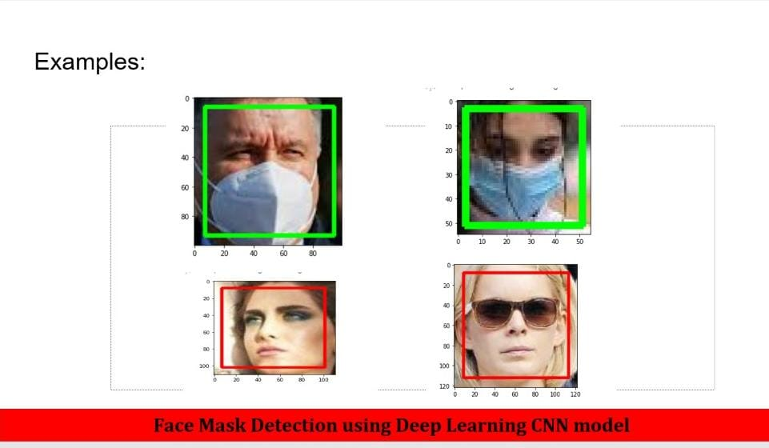

# Face-Mask-Detection

This model checks if a person is wearing face-mask or not.   
It detects faces using OpenCV.  
Classification is done using Deep-Learning Model. 
The model contains Tensorflow-Keras and CNN Layers. 

The dataset used to train the model contains 12,000 images. 
Dataset Link: https://www.kaggle.com/ashishjangra27/face-mask-12k-images-dataset

  Examples
  

 
